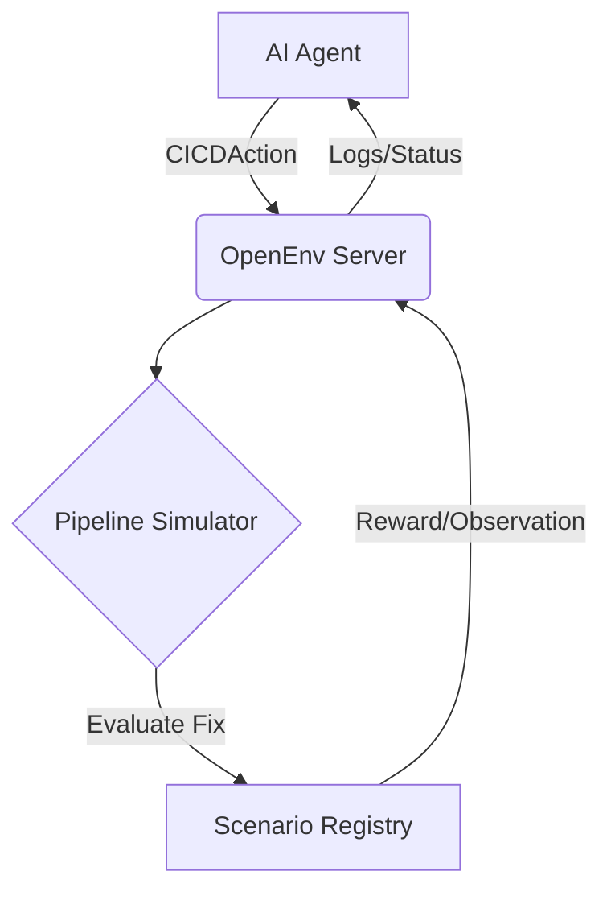

# 🔧 CI/CD Pipeline Diagnosis Environment

[](https://github.com/meta-pytorch/OpenEnv)
[](https://huggingface.co/meta-llama/Llama-3.1-8B-Instruct)
[](https://www.docker.com/)
[](https://opensource.org/licenses/MIT)

An **OpenEnv-compliant** evaluation environment for AI agents, simulating real-world CI/CD pipeline failures. Agents must diagnose root causes from logs, propose file-level fixes, and verify remediations—a critical skill for next-generation AI DevOps Engineers.

---

## 📽️ Project Links

- **Hugging Face Space**: [shreeyanshi03/cicd-pipeline-diagnosis-env](https://huggingface.co/spaces/shreeyanshi03/cicd-pipeline-diagnosis-env)
- **Scenario Dataset**: [shreeyanshi03/cicd-pipeline-diagnosis](https://huggingface.co/datasets/shreeyanshi03/cicd-pipeline-diagnosis)
- **GitHub Repository**: [shreeyanshi123/OpenEnv-Hackathon](https://github.com/shreeyanshi123/OpenEnv-Hackathon)

---

## 🚀 Quick Start for Judges

To reproduce the Llama 3.1 baseline in **less than 60 seconds**:

```bash
# 1. Clone & Install
git clone https://github.com/shreeyanshi123/OpenEnv-Hackathon
cd OpenEnv-Hackathon
pip install -e .

# 2. Set Environment Variables
export HF_TOKEN="your_huggingface_token"
export API_BASE_URL="https://router.huggingface.co/v1"
export MODEL_NAME="meta-llama/Llama-3.1-8B-Instruct"

# 3. Run Evaluation
python inference.py
```

---

## 🧠 Architecture Overview

The environment core uses a deterministic **Rule-Based Simulator** to ensure 100% reproducibility across different hardware/operating systems.



---

## 📂 The Scenario Library (15+ Realistic Failures)

We provide a dense library of failure scenarios across 4 critical DevOps domains:

| Domain | Example Failure | Root Cause |
|--------|----------------|------------|
| **Dependency** | `ModuleNotFoundError` | Missing entry in `requirements.txt` |
| **Build** | Docker Layer Failure | Typo in `Dockerfile` commands |
| **Test** | Flaky Unit Tests | Race conditions or environment mismatches |
| **Network** | DNS Lookup Failure | Misconfigured proxy or internal service DNS |

---

## 🎯 Task Definitions

The environment supports three distinct agent tasks:

1.  **`log_diagnosis` (Easy)**: Identify the root cause from pipeline logs.
2.  **`suggest_fix` (Medium)**: Identify the cause and provide the corrected file content.
3.  **`auto_remediate` (Hard)**: Diagnose, Fix, and Re-run the pipeline to verify the pass.

---

## ✅ Compliance Checklist (Self-Declared)

- [x] **OpenEnv Interface**: Fully implements `step()`, `reset()`, and `state()` via FastAPI.
- [x] **Inference Logging**: Strictly follows the `[START]`, `[STEP]`, `[END]` logging format.
- [x] **Model Compatibility**: Baseline tested with `meta-llama/Llama-3.1-8B-Instruct`.
- [x] **Deployment**: Root-level `Dockerfile` optimized for Hugging Face Spaces.
- [x] **Performance**: Runs efficiently within 2 vCPU / 8GB RAM limits.

---

## 🛠️ Local Development

### Running with Docker

```bash
docker build -t cicd-env .
docker run -p 8000:7860 cicd-env
```

---

## 📄 License
MIT License. Created for the Meta Llama 3 Hackathon.
